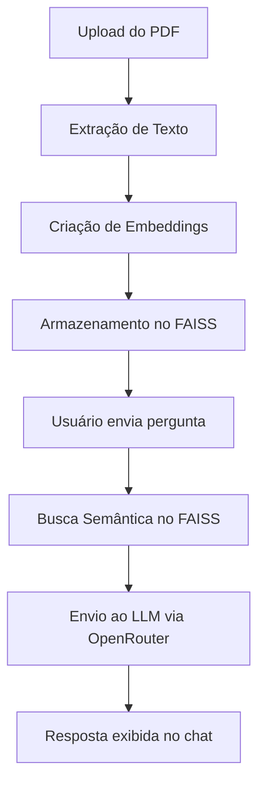

# ChatPDF Inteligente - Leitura de Documentos com IA

## Visão Geral

🔗 **Acesse o projeto:** [ChatPDF Inteligente no Hugging Face Spaces](https://huggingface.co/spaces/seuusuario/chatpdf-inteligente)

O **ChatPDF Inteligente** é uma aplicação de leitura interativa de documentos em PDF, utilizando **IA generativa**, **vetorização semântica** e **modelos de linguagem open-source**. A solução permite que qualquer usuário faça **perguntas em linguagem natural** sobre um documento carregado e receba respostas diretas e contextualizadas.

### Principais Funcionalidades

- 📄 **Leitura automática de PDFs**
- 💬 **Interação via perguntas em linguagem natural**
- 🤖 **Respostas com LLMs integradas via OpenRouter**
- 🧠 **Vetorização com embeddings da Hugging Face**
- 🔍 **Busca semântica com FAISS**
- 🌐 **Interface simples e intuitiva com Gradio**

---

## Arquitetura Técnica

| Componente            | Tecnologia            | Descrição                                         |
|-----------------------|------------------------|---------------------------------------------------|
| Backend de IA         | LangChain + Python 3.10 | Coordena o fluxo entre uploads, embeddings e LLM |
| Vetorização           | Hugging Face Embeddings | Conversão semântica dos documentos PDF            |
| Banco Vetorial        | FAISS                   | Busca rápida e contextual de respostas            |
| Interface             | Gradio                  | Navegador amigável com suporte a PDF + chat       |
| LLM                   | OpenRouter              | Respostas geradas com modelos de linguagem         |

---

## Fluxo de Funcionamento



---

## 🧪 Exemplo de Uso

1. Faça upload de um arquivo PDF.
2. Digite uma pergunta como:
   - "Qual o objetivo deste documento?"
   - "Liste os principais tópicos abordados."
   - "Explique o conceito X de forma simples."
3. Clique em "Enviar" e receba a resposta baseada no conteúdo do PDF.

---

## Como Executar

### Pré-requisitos

```bash
Python 3.10+
pip install -r requirements.txt
```

### Instalação

```bash
git clone https://github.com/seuusuario/chatpdf-inteligente.git
cd chatpdf-inteligente
pip install -r requirements.txt
```

### Configuração da API

Adicione sua chave da OpenRouter no terminal ou arquivo `.env`:

```bash
export OPENROUTER_API_KEY=sua-chave-aqui
```

### Execução Local

```bash
python app.py
```

---

## Estrutura de Arquivos

```
chatpdf-inteligente/
├── app.py                  # Código principal da aplicação
├── requirements.txt        # Dependências do projeto
├── .env.example            # Exemplo de arquivo para variáveis de ambiente
└── README.md               # Este arquivo
```

---

## Destaques Técnicos

### 1. Vetorização com Embeddings da Hugging Face

```python
from langchain.embeddings import HuggingFaceEmbeddings

embeddings = HuggingFaceEmbeddings(model_name="all-MiniLM-L6-v2")
```

### 2. Armazenamento em FAISS

```python
from langchain.vectorstores import FAISS

vectorstore = FAISS.from_documents(documentos, embeddings)
```

### 3. Geração de Respostas com OpenRouter

```python
from langchain.chat_models import ChatOpenRouter

llm = ChatOpenRouter(api_key=os.getenv("OPENROUTER_API_KEY"))
```

---

## 💡 Sobre o Projeto

Este projeto foi criado como parte de um experimento educacional para explorar o poder das **LLMs**, **embeddings** e **sistemas conversacionais aplicados a documentos PDF**.

Ideal para estudantes, pesquisadores, profissionais ou qualquer pessoa que deseje **interagir de forma inteligente com conteúdos complexos**.

---

## 📚 Bootcamp

📌 Projeto desenvolvido durante o **Bootcamp de LLM (Modelos de Linguagem de Grande Escala)** da **SoulCode Academy**, com apoio do **Grupo Petrópolis**.

---

## 📄 Licença

Distribuído sob a licença MIT. Veja o arquivo `LICENSE` para mais informações.

---

<div align="center">  
  <p>Desenvolvido com ❤️ por <a href="https://github.com/crislenenunes">Crislene Nunes</a> durante o Bootcamp de IA LLM da SoulCode</p>  
    
    
    
</div>
